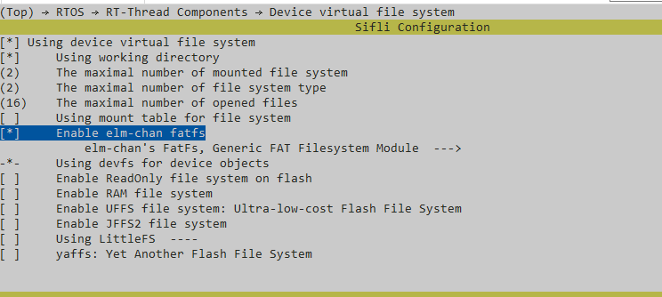
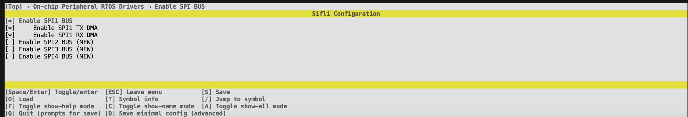
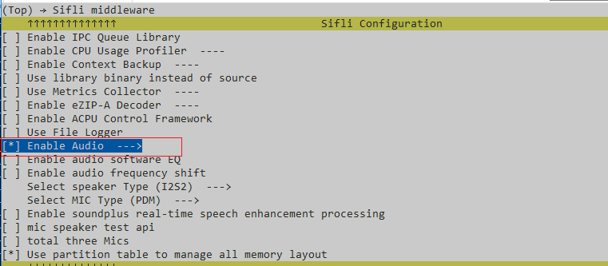
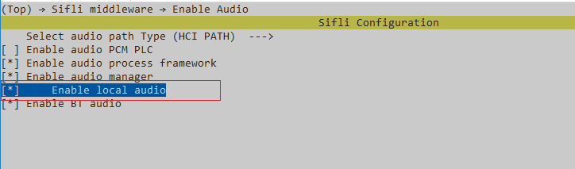
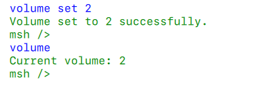

# MP3 SD 音乐播放器

参考源码路径：example/multimedia/audio/mp3_sd_player

## 支持的平台
<!-- 支持哪些板子和芯片平台 -->
+ sf32lb52-lchspi-ulp

## 概述
<!-- 例程简介 -->
基于黄山派播放example/multimedia/audio/mp3_sd_player例程进行修改。首先在SD创建music文件夹存放mp3文件，然后创建music_txt文件夹存放歌词文本。

## 修改说明
* 增加UI界面，显示音乐列表，支持播放音乐，暂停音乐，下一首音乐，上一首音乐，音乐进度条
* 修改原按键控制逻辑,在不接电池情况下可以正常使用。key1单击上一首，key2长按播放/暂停，key2单击下一首。
* 增加音乐播放模式，支持单曲循环，列表循环，随机播放
* 增加音乐列表直接跳转
* 增加进度条拖拽快进功能

## 存在问题：
* fatfs设置成936编码，读取中文文件名，但歌词文本可以正常显示。


## 例程的使用
<!-- 说明如何使用例程，比如连接哪些硬件管脚观察波形，编译和烧写可以引用相关文档。
对于 rt_device 的例程，还需要把本例程用到的配置开关列出来，比如 PWM 例程用到了 PWM1，需要在 onchip 菜单里使能 PWM1 -->

### 硬件需求
运行该例程前，需要准备：
+ 一块本例程支持的开发板（[支持的平台](quick_start)）。
+ 喇叭。

```{warning}
需要注意的是，在`sf32lb52-lchspi-ulp`平台上需要外接电池，否则长按按键会无法检测到。
```

### menuconfig 配置

1. 本例程需要读写文件，所以需要用到文件系统，配置`FAT`文件系统：

1. 本例程使用 SPI1 作为 SD 卡的接口，所以需要使能 SPI1：

1. 本例程中的 SD 卡使用 SPI 进行驱动，所以需要使能`MSD`驱动

1. 使能 AUDIO CODEC 和 AUDIO PROC：

1. 使能 AUDIO(`AUDIO`)：

1. 使能 AUDIO MANAGER.(`AUDIO_USING_MANAGER`)

1. (`AUDIO_LOCAL_MUSIC`)


### 编译和烧录

切换到例程 project 目录，运行 scons 命令执行编译：

```bash
scons --board=sf32lb52-lchspi-ulp -j32
```

切换到例程`project/build_xx`目录，运行`uart_download.bat`，按提示选择端口即可进行下载：

```bash
$ ./uart_download.bat

     Uart Download

please input the serial port num:5
```

或者执行下面命令进行烧录
```bash
$ build_sf32lb52-lchspi-ulp_hcpu\uart_download.bat
```
关于编译、下载的详细步骤，请参考 [快速上手](quick_start) 的相关介绍。

## 例程的预期结果
<!-- 说明例程运行结果，比如哪几个灯会亮，会打印哪些 log，以便用户判断例程是否正常运行，运行结果可以结合代码分步骤说明 -->
基于黄山派播放SD例程进行修改，首先在SD创建按music文件夹存放mp3文件，然后创建music_txt文件夹存放歌词文本，相较于原例程，增添了UI界面，修改了按键控制逻辑

例程也提供了一个 shell 接口，可以通过`volume`命令获取或设置音量。输入`volume`命令可以查看当前音量，输入`volume set <value>`可以设置音量，`<value>`的范围是 0-15。

!

## 异常诊断

## 参考文档
<!-- 对于 rt_device 的示例，rt-thread 官网文档提供的较详细说明，可以在这里添加网页链接，例如，参考 RT-Thread 的 [RTC 文档](https://www.rt-thread.org/document/site/#/rt-thread-version/rt-thread-standard/programming-manual/device/rtc/rtc) -->

## 更新记录
|版本 |日期   |发布说明 | 作者 |
|:---|:---|:---|:---|    
|0.0.1 |7/2025 |初始版本 | ryh |
| | | |
